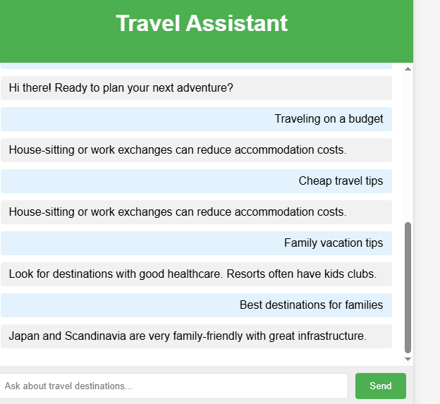

🌍 Travel Assistant Chatbot

[](https://www.python.org/)
[](https://flask.palletsprojects.com/)
[](https://www.tensorflow.org/)

An intelligent chatbot that helps with travel planning using natural language processing (NLP) and machine learning.

 

## ✨ Features

- **Destination recommendations** based on user preferences
- **Visa requirement** guidance
- **Packing list** generator
- **Local customs & etiquette** tips
- **Weather & season** advice
- **Interactive web interface**

## 🛠️ Tech Stack

| Component       | Technology |
|-----------------|------------|
| Backend         | Python, Flask |
| NLP Engine      | TensorFlow, NLTK |
| Frontend        | HTML5, CSS3, JavaScript |


## 📂 Project Structure
```
travel-assistant/
├── backend/          # Flask application
│   ├── app.py        # Main application
│   ├── nlp_model/    # Trained models
│   └── requirements.txt
├── frontend/         # Web interface
│   ├── static/       # CSS/JS
│   └── templates/    # HTML files
└── README.md
```

